# BotExtended

This script adds a wide variety of bots to spice up combat experience. It is currently
under development and maybe full of bugs :bug:

<!-- ## Features
- **Large variety of bots**: 60+ new bots for you to fight. No more having to fight hard and expert bots all the time.
- **Bot faction:** Bots will be spawned in many different factions: Thug, Police, Soldier, Assassin, Zombie... to keep you engaging every round.
- **Bosses with special abilities:** Multiple bosses that have special abilities and unique starting weapons to ramp up challenge if you are getting bored of winning expert bots in vanilla.
- **Reaction with dialogue:** Bots can have dialogues depend on the context and evironment around it
- **Special weapons**: Some bots have special weapons that can not be found otherwise. Kill it and get the big reward or die trying! -->

## Getting Started

- Download [this file](src/BotExtended/BotExtended.txt)
- Move it to `%USERPROFILE%\Documents\Superfighters Deluxe\Scripts\`
- Run `setup_script.py`

```bash
python scripts/setup_script.py 'C:\Program Files (x86)\Steam\steamapps\common\Superfighters Deluxe'
```

## Powerups

- See the full list of all melee powerups [here](./docs/POWERUPS_MELEE.md).

- See the full list of all ranged powerups [here](./docs/POWERUPS_RANGED.md).

## Factions

- See the full list of all factions [here](./docs/FACTIONS.md).

## Bots

### Assassin Melee

<div>
  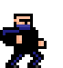
  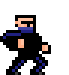
  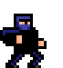
  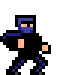
  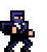
  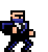
</div>

#### **Stats**

| **Health**    | Below Normal                                                                                                        |
| :------------ | :------------------------------------------------------------------------------------------------------------------ |
| **Speed**     | Very Fast                                                                                                           |
| **AI**        | Jogger + Melee Hard                                                                                                 |
| **Weapons**   | ![katana]                                                                                                           |
| **Factions**  | [Assassin][fassassin]                                                                                               |
| **Abilities** | All assassins in a team target one specific enemy at a time. The targeted player has an indicator above their head. |

<details>
  <summary>
    <strong>Other Stats</strong>
  </summary>

| Stats                       | Value        |
| :-------------------------- | :----------- |
| **Projectile Damage Dealt** | Below Normal |
| **Melee Damage Dealt**      | Below Normal |
| **Size**                    | Below Normal |

</details>

<!-- GIF: show assassin gang rape -->

### Assassin Range

They are the same as [Assassin Melee](#Assassin-Melee) except for the following stats:

#### **Stats**

| **AI**      | Jogger + Range Hard |
| :---------- | :------------------ |
| **Weapons** | ![uzi]              |

### Agent

<div>
  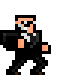
  
</div>

#### **Stats**

| **Health**       | Below Normal                            |
| :--------------- | :-------------------------------------- |
| **AI**           | Hard                                    |
| **Search items** | Secondary                               |
| **Factions**     | [Agent][fagent], [MetroCop][fmetrocop]. |

#### **Weapons**

| Gears                    | Powerup  |
| :----------------------- | :------- |
| ![pistol]                | [Poison] |
| ![pistol] ![Lazer]       | [Poison] |
| ![baton]                 |          |
| ![ShockBaton]            |          |
| ![Magnum] ![Lazer]       | [Poison] |
| ![baton] ![Uzi] ![Lazer] | [Poison] |
| ![DarkShotgun] ![Lazer]  | [Poison] |

<details>
  <summary>
    <strong>Other Stats</strong>
  </summary>

| Stats                       | Value        |
| :-------------------------- | :----------- |
| **Projectile Damage Dealt** | Below Normal |
| **Melee Damage Dealt**      | Below Normal |
| **Size**                    | Below Normal |

</details>

### Bandido

<div>
  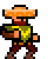
  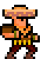
  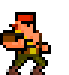
  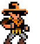
  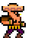
  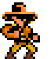
  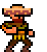
</div>

#### **Stats**

| **Health**        | Below Normal                                                                     |
| :---------------- | :------------------------------------------------------------------------------- |
| **AI**            | Cowboy                                                                           |
| **Infinite Ammo** | True                                                                             |
| **Factions**      | [Bandido][fbandido], [Cowboy][fcowboy].                                          |
| **Abilities**     | Spawns an ammo stash on death that shoots 500 stray bullets in random direction. |

#### **Weapons**

| Gears                           | Powerup |
| :------------------------------ | :------ |
| ![machete] ![revolver]          |         |
| ![knife] ![carbine] ![revolver] |         |
| ![knife] ![shotgun] ![pistol]   |         |

<details>
  <summary>
    <strong>Other Stats</strong>
  </summary>

| Stats                       | Value        |
| :-------------------------- | :----------- |
| **Projectile Damage Dealt** | Below Normal |
| **Melee Damage Dealt**      | Below Normal |
| **Size**                    | Below Normal |

</details>

<!-- GIF: show ammo stash and stray bullets -->

### Biker

<div>
  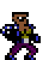
  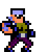
  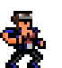
  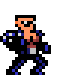
  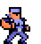
  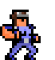
  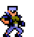
  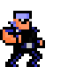
  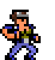
  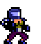
  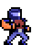
  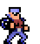
</div>

#### **Stats**

| **Health**    | Below Normal                                                                                                                                                                                            |
| :------------ | :------------------------------------------------------------------------------------------------------------------------------------------------------------------------------------------------------ |
| **AI**        | Grunt                                                                                                                                                                                                   |
| **Factions**  | [Biker][fbiker], [Punk][fpunk], [Thug][fthug].                                                                                                                                                          |
| **Abilities** | <li>Has a gather spot, the gather spot is changed every 42 seconds.</li><li>Gains 4 health after dealing melee damage.</li><li>Has 3% chance of stealing an enemy's weapon after a successful hit.</li> |

#### **Weapons**

| Gears       | Powerup |
| :---------- | :------ |
| ![leadpipe] |         |
| ![chain]    |         |
| ![knife]    |         |

<details>
  <summary>
    <strong>Other Stats</strong>
  </summary>

| Stats                       | Value        |
| :-------------------------- | :----------- |
| **Projectile Damage Dealt** | Below Normal |
| **Melee Damage Dealt**      | Below Normal |
| **Size**                    | Below Normal |

</details>

<!-- GIF: show gather spot -->

### Biker Hulk

Same profiles as [Biker].

#### **Stats**

| **Health**    | Strong                                  |
| :------------ | :-------------------------------------- |
| **Speed**     | Slow                                    |
| **AI**        | Hulk                                    |
| **Factions**  | [Biker][fbiker], [Stripper][fstripper]. |
| **Abilities** | Same as [Biker].                        |

#### **Weapons**

| Gears   | Powerup    |
| :------ | :--------- |
| ![fist] | [Breaking] |

<details>
  <summary>
    <strong>Other Stats</strong>
  </summary>

| Stats                       | Value        |
| :-------------------------- | :----------- |
| **Projectile Damage Dealt** | Very Low     |
| **Melee Damage Dealt**      | Above Normal |
| **Melee Force**             | Strong       |
| **Size**                    | Very Big     |

</details>

### Bodyguard

<div>
  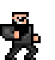
</div>

#### **Stats**

| **Health**   | Below Normal                                |
| :----------- | :------------------------------------------ |
| **AI**       | Grunt                                       |
| **Weapons**  | ![pistol]                                   |
| **Factions** | [Stripper][fstripper], [Kingpin][fkingpin]. |

<details>
  <summary>
    <strong>Other Stats</strong>
  </summary>

| Stats                       | Value        |
| :-------------------------- | :----------- |
| **Projectile Damage Dealt** | Below Normal |
| **Melee Damage Dealt**      | Below Normal |
| **Size**                    | Below Normal |

</details>

### Bodyguard 2

Same as [Bodyguard] except for the following stats:

#### **Stats**

| **Weapons**  | ![tommygun]         |
| :----------- | :------------------ |
| **Factions** | [Kingpin][fkingpin] |

### Cyborg

<div>
  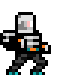
  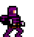
  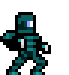
  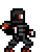
  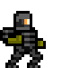
  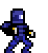
</div>

#### **Stats**

| **Health**          | Below Normal    |
| :------------------ | :-------------- |
| **AI**              | Grunt           |
| **Zombie Immunity** | True            |
| **Factions**        | [Robot][frobot] |

#### **Weapons**

| Gears            | Powerup  |
| :--------------- | :------- |
| ![MachinePistol] | [Homing] |
| ![Pistol]        | [Homing] |
| ![Pistol45]      | [Homing] |
| ![DarkShotgun]   | [Homing] |

<details>
  <summary>
    <strong>Other Stats</strong>
  </summary>

| Stats                       | Value        |
| :-------------------------- | :----------- |
| **Projectile Damage Dealt** | Below Normal |
| **Melee Damage Dealt**      | Below Normal |
| **Size**                    | Below Normal |

</details>

<!-- GIF: show near death effect -->

### Clown Bodyguard

<div>
  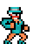
  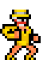
  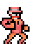
  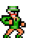
</div>

#### **Stats**

| **Health**   | Below Normal    |
| :----------- | :-------------- |
| **AI**       | Grunt           |
| **Factions** | [Clown][fclown] |

#### **Weapons**

| Gears     | Powerup |
| :-------- | :------ |
| ![Katana] |         |
| ![Knife]  |         |
| ![Axe]    |         |
| ![Bat]    |         |

<details>
  <summary>
    <strong>Other Stats</strong>
  </summary>

| Stats                       | Value        |
| :-------------------------- | :----------- |
| **Projectile Damage Dealt** | Below Normal |
| **Melee Damage Dealt**      | Below Normal |
| **Size**                    | Below Normal |

</details>

### Clown Boxer

<div>
  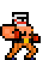
</div>

#### **Stats**

| **Health**   | Above Normal    |
| :----------- | :-------------- |
| **AI**       | Hulk            |
| **Factions** | [Clown][fclown] |

<details>
  <summary>
    <strong>Other Stats</strong>
  </summary>

| Stats                       | Value        |
| :-------------------------- | :----------- |
| **Projectile Damage Dealt** | Very Low     |
| **Melee Damage Dealt**      | Above Normal |
| **Melee Force**             | Strong       |
| **Size**                    | Very Big     |

</details>

### Ass Kicker

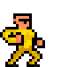

### Spy

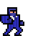

## Script Commands

BotExtended can be played using the default settings without you having to touch the command line. But if you want to customize or try out different bots, weapons or factions, this section is for you.

By default, the game spawns a random faction (See the faction list [here](#list-of-factions)) in team 4 in every match.

All of the commands start with `/botextended` or `/be`. Some commands may require one or more arguments.

### `help`

Usage: `/<botextended|be> help|h|?`

Print all other commands and arguments you can pass to BotExtended.

### `version`

Usage: `/<botextended|be> version|v`

Print the current version of BotExtended.

### `listfaction`

Usage: `/<botextended|be> [listfaction|lf]`

List all of the available `BotFaction`s. A `BotFaction` consists of one or many different bots in a specific theme, for example: Assassin, Police, Zombie... Some `BotFaction`s only have one bot, usually a boss.

A boss is a much stronger bot and often come with special abilities: Mecha boss with bulletproof armor, Demolitionist who can one shot one kill. They are much harder to kill and is equivalent with several expert bots.

`BotFaction`s whose names prefixed with `Boss` will have at least one boss, sometimes spawn with its minions. (Kinpin and bodyguards, BadSanta and his Elks)

```
/be lf
```

#### List of factions

<details>
  <summary>Click to open</summary>

```
0: None
1: Assassin
2: Agent
3: Bandido
4: Biker
5: Clown
6: Cowboy
7: Engineer
8: Farmer
9: Gangster
10: Hunter
11: MetroCop
12: Mutant
13: Nazi
14: Police
15: PoliceSWAT
16: Pyromaniac
17: Robot
18: Scientist
19: Sniper
20: Soldier
21: Spacer
22: SpaceSniper
23: Stripper
24: Survivor
25: Thug
26: Punk
27: Zombie
28: ZombieMutated
200: Boss_Demolitionist
201: Boss_Agent79
202: Boss_Amos
203: Boss_Balista
204: Boss_Balloonatic
205: Boss_BazookaJane
206: Boss_Beast
207: Boss_Berserker
208: Boss_BigMutant
209: Boss_Bobby
210: Boss_Boffin
211: Boss_Chairman
212: Boss_Cindy
213: Boss_PoliceChief
214: Boss_Funnyman
215: Boss_Jo
216: Boss_Hacker
217: Boss_Handler
218: Boss_HeavySoldier
219: Boss_Hitman
220: Boss_Incinerator
221: Boss_Firebug
222: Boss_Fireman
223: Boss_Kingpin
224: Boss_MadScientist
225: Boss_Kriegbar
226: Boss_Meatgrinder
227: Boss_Mecha
228: Boss_MetroCop
229: Boss_MirrorMan
230: Boss_Nadja
231: Boss_Napoleon
232: Boss_Ninja
233: Boss_President
234: Boss_Quillhogg
235: Boss_Rambo
236: Boss_Raze
237: Boss_Reznor
238: Boss_Santa
239: Boss_Sheriff
240: Boss_Smoker
241: Boss_Survivalist
242: Boss_Translucent
243: Boss_Teddybear
244: Boss_ZombieFighter
245: Boss_ZombieEater
```

</details>

### `listbot`

Usage: `/<botextended|be> [listbot|lb]`

List all available `BotType`s.

`BotType` describes a specific bot's appearance, stats and behavior. Each `BotType` has different outfits, starting weapons, modifiers, AI behaviors and special abilities. A `BotFaction` must have multiple `BotType`s in the same theme. For example, Clown `BotFaction` can spawn ClownCowboy, ClownGangster and ClownBoxer `BotType`, but cannot spawn Gangster.

```
/be lb
```

<details>
    <summary>Result</summary>

```
0: None
1: AssassinMelee
2: AssassinRange
3: Agent
4: Bandido
5: Biker
6: BikerHulk
7: Bodyguard
8: Bodyguard2
9: Cyborg
10: LabAssistant
11: Scientist
12: ClownBodyguard
13: ClownBoxer
14: ClownCowboy
15: ClownGangster
16: Cowboy
17: Elf
18: Engineer
19: Farmer
20: Gangster
21: GangsterHulk
22: Gardener
23: Hunter
24: Lumberjack
25: MetroCop
26: Mutant
27: NaziLabAssistant
28: NaziHulk
29: NaziScientist
30: NaziSoldier
31: Police
32: PoliceSWAT
33: Survivor
34: Sniper
35: Soldier
36: Spacer
37: SpaceSniper
38: Stripper
39: SuicideDwarf
40: Thug
41: ThugHulk
42: Punk
43: PunkHulk
44: Zombie
45: ZombieAgent
46: ZombieBruiser
47: ZombieChild
48: ZombieFat
49: ZombieFlamer
50: ZombieGangster
51: ZombieNinja
52: ZombiePolice
53: ZombiePrussian
54: ZombieSoldier
55: ZombieThug
56: ZombieWorker
57: Agent79
58: Amos
59: Balista
60: Balloonatic
61: BazookaJane
62: Beast
63: Berserker
64: BigMutant
65: Bobby
66: Boffin
67: Chairman
68: Cindy
69: Demolitionist
70: Jo
71: Fireman
72: Firebug
73: Fritzliebe
74: Funnyman
75: Hacker
76: Handler
77: HeavySoldier
78: Hitman
79: Incinerator
80: Pyromaniac
81: Kingpin
82: Kriegbar
83: MetroCop2
84: Meatgrinder
85: Mecha
86: MirrorMan
87: Nadja
88: Napoleon
89: Ninja
90: PoliceChief
91: President
92: Quillhogg
93: Rambo
94: Raze
95: Reznor
96: Santa
97: Sheriff
98: Smoker
99: SSOfficer
100: Survivalist
101: Teddybear
102: Translucent
103: Babybear
104: ZombieEater
105: ZombieFighter
```

</details>

### `listrangedpowerup`

Usage: `/<botextended|be> [listrangedpowerup|lrp]`

List all ranged powerups. See [`setweapon`](#setweapon) command for further detail.

```
/be lrp
```

<details>
    <summary>Result</summary>

```
0: None
1: Blackhole
2: Blast
3: Bow
4: Delay
5: Dormant
6: DoublePenetration
7: DoubleTrouble
8: Fatigue
9: Fire
10: Helium
11: Hunting
12: Homing
13: Gauss
14: Grapeshot
15: Gravity
16: GravityDE
17: InfiniteBouncing
18: Minigun
19: Molotov
20: Lightning
21: Object
22: Penetration
23: Poison
24: Present
25: Riding
26: Shotgun
27: Shrapnel
28: Shrinking
29: Smoke
30: Stun
31: Spinner
32: Steak
33: StickyBomb
34: SuicideDove
35: SuicideFighter
36: Taser
37: Tearing
38: Termite
39: Welding
```

</details>

### `listmeleepowerup`

Usage: `/<botextended|be> [listmeleepowerup|lmp]`

List all melee powerups. See [`setweapon`](#setweapon) command for further detail.

```
/be lrp
```

<details>
    <summary>Result</summary>

```
0: None
1: Breaking
2: Earthquake
3: FireTrail
4: Hurling
5: Gib
6: GroundBreaker
7: GroundSlam
8: Megaton
9: Pushback
10: Serious
11: Slide
12: Splitting
```

</details>

### `findfaction`

Usage: `/<botextended|be> [findfaction|ff] <query>`

Find all bot factions that match query

```
/be ff zombie
```

```
--BotExtended find results--
14: Zombie
15: ZombieHard
213: Boss_Zombie
```

### `settings`

Usage: `/<botextended|be> [settings|s]`

Display current script settings

```
/be s
```

### `create`

Usage: `/<botextended|be> [create|c] <BotType> [1|2|3|4|_] [Count]`

Spawn one or a group of bots. First argument is `BotType`. See [`listbot`](#listbot) to list all `BotType`s. This is the only required argument.

The second argument is the team to spawn from `t1` to `t4`, `t0` is independent. Default to independent.

Third argument is the number of bot to spawn. Default to 1.

_Example_:

Spawn one funnyman

```
/be c funnyman
```

Spawn 5 metrocops at Team 2

```
/be c 34 t2 5
```

Spawn 3 bandidos at team independent

```
/be c bandido t0 3
```

Spawn 1 cowboy at team 2

```
/be c cowboy t2
```

Spawn 2 cowboy at team independent

```
/be c bandido 2
```

### `botcount`

Usage: `/<botextended|be> [botcount|bc] <1-10>`

Set the maximum bot count for a round. Be aware the number of bots will be capped based on 2 factors. The number of available `SpawnPlayer`s in the map and the `botcount` itself. So when you set `botcount` to 8 it will only spawn all 8 bots if the map is big enough to have all of the `SpawnPlayer`s needed.

How it works: On startup of every round, the script will search for the number of `SpawnPlayer` tiles in the map, and subtract the number of players and regular bots that have already spawned. That number then is capped again if it exceeds the `botcount` limit.

```
/be bc 2
```

### `faction`

Usage: `/<botextended|be> [Team] [faction|f] [-e] <names|indexes|all>`

Select a list of `BotFaction`s by either name or index to randomly spawn on startup. Each faction is separated by a space. `all` argument means randomizing all `BotFaction`s. Add -e flag before the argument list to exclude those `BotFaction`s instead. Select `none` to disable spawning bot to that team. Team arguments ranges from `t1` to `t4`

```bash
/be f sniper thug boss_jo boss_hacker
```

You can use the index instead of `BotFaction` name to shorten the command. See [`listfaction`](#listfaction) for more detail.

```
/be f 11 13 202 203
```

Select all factions.

```
/be f all
```

Select all except zombie factions.

```
/be f -e Zombie ZombieHard Boss_Zombie
```

Don't spawn bots on team 3.

```
/be f t3 none
```

To select one `BotFaction` to spawn every round, simply select that `BotFaction` only and set [`factionrotation`](#factionrotation) to `0` to disable rotation.

```bash
/be fr 0
/be f biker
```

### `factionrotation`

Usage: `/<botextended|be> [factionrotation|fr] <0-10>`

Set faction rotation interval for every n rounds. Set `0` to disable rotation

```
/be fr 4
```

### `nextfaction`

Usage: `/<botextended|be> [nextfaction|nf]`

Change the faction in the current faction rotation to the next faction

```
/be nf
```

### `setplayer`

Usage: `/<botextended|be> [setplayer|sp] <player> <BotType>`

Set player outfit, weapons and modifiers to the same as `BotType`. Player argument can be either name or slot index. Type `/listplayers`
to see the list of players and their respective indexes. this settings will be saved permanently. To reset, replace `BotType` value with `None`.
Use [`clearplsettings`](#clearplsettings) to reset settings for all players.

Set player 0 to funnyman

```
/be sp 0 funnyman
```

Reset player Spud to normal

```
/be sp spud none
```

### `setweapon`

Usage: `/<botextended|be> [setweapon|sw] <player> <WeaponItem> <Powerup>`

Give specific player a powerup weapon.

Give player 'your_name' an electroshock magnum.

```
/be setweapon your_name magnum stun
```

Give player 'near' hurl powerup. None weapon means barehand.

```
/be setweapon near none hurl
```

Same command as above but use indexes to shorten the command.

```
/be sw 0 1 1
```

Remove powerup. Magnum now fires normal rounds.

```
/be sw near magnum none
```

Remove all powerup weapons that in the player's inventory (not apply until the next round).

```
/be sw near none
```

### `clearplsettings`

Usage: `/<botextended|be> [clearplsettings|cp]`

Clear all player settings.

## Development

- Clone [ScriptLinker](https://github.com/nearhuscarl/scriptlinker) project on my github.
- Build in DEBUG mode. The global hotkeys doesn't work in RELEASE mode for some reasons but I'm too lazy to fix it now.
- Open ScriptLinker > Script > New, then enter the _Name_, _Entry Point_ and _Project Directory_. Remind me to add a way to read the script metedata in the future.

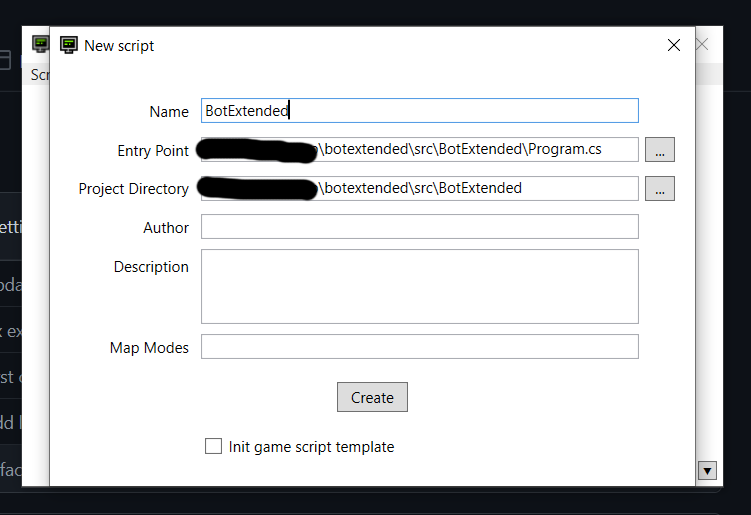

- Open [this](./src) solution in _Visual Studio_.
- In BotExtended project, Click Reference > Add Reference > Browse > Select `...\Steam\steamapps\common\Superfighters Deluxe\SFD.GameScriptInterface.dll`
- Start coding and press `F8` to save change.

<!-- bot type -->

[biker]: #biker
[bodyguard]: #bodyguard

<!-- Factions -->

[fassassin]: ./docs/FACTIONS.md#assassin
[fagent]: ./docs/FACTIONS.md#agent
[fbandido]: ./docs/FACTIONS.md#bandido
[fbiker]: ./docs/FACTIONS.md#biker
[fcowboy]: ./docs/FACTIONS.md#cowboy
[fclown]: ./docs/FACTIONS.md#clown
[fmetrocop]: ./docs/FACTIONS.md#metro-cop
[fpunk]: ./docs/FACTIONS.md#punk
[fstripper]: ./docs/FACTIONS.md#stripper
[fthug]: ./docs/FACTIONS.md#thug
[fkingpin]: ./docs/FACTIONS.md#kingpin
[frobot]: ./docs/FACTIONS.md#robot

<!-- Melee Powerups -->

[breaking]: ./docs/POWERUPS_MELEE.md#breaking

<!-- Ranged Powerups -->

[poison]: ./docs/POWERUPS_RANGED.md#poison
[homing]: ./docs/POWERUPS_RANGED.md#homing

<!-- weapons -->

[axe]: ./docs/Images/Weapons/Axe.png
[bat]: ./docs/Images/Weapons/Bat.png
[baton]: ./docs/Images/Weapons/Baton.png
[bazooka]: ./docs/Images/Weapons/Bazooka.png
[carbine]: ./docs/Images/Weapons/Carbine.png
[chain]: ./docs/Images/Weapons/Chain.png
[darkshotgun]: ./docs/Images/Weapons/DarkShotgun.png
[fist]: ./docs/Images/Weapons/Fist.png
[katana]: ./docs/Images/Weapons/Katana.png
[knife]: ./docs/Images/Weapons/Knife.png
[lazer]: ./docs/Images/Weapons/Lazer.png
[leadpipe]: ./docs/Images/Weapons/LeadPipe.png
[machete]: ./docs/Images/Weapons/Machete.png
[machinepistol]: ./docs/Images/Weapons/MachinePistol.png
[magnum]: ./docs/Images/Weapons/Magnum.png
[pistol]: ./docs/Images/Weapons/Pistol.png
[pistol45]: ./docs/Images/Weapons/Pistol45.png
[revolver]: ./docs/Images/Weapons/Revolver.png
[shockbaton]: ./docs/Images/Weapons/ShockBaton.png
[shotgun]: ./docs/Images/Weapons/Shotgun.png
[tommygun]: ./docs/Images/Weapons/TommyGun.png
[uzi]: ./docs/Images/Weapons/Uzi.png
