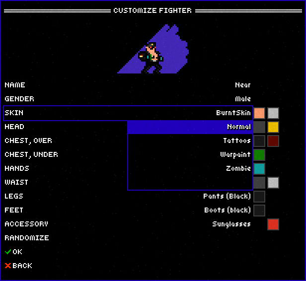
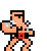
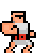

# Superfighters Deluxe

## How to customize your figher's costumes

**Caveat:** This tutorial only works for offline games. If you play an online game with a custom costume and other people don't have it, the game may be crashed.

### How to pack and unpack the item files

Costume data in SFD are stored in `*.xnb` files inside `Superfighters Deluxe\Content\Data\Items`. `xnb` files are binary, to view the content inside it, copy one of the files to the `packed` folder, then run:

```
npm run unpack
```

Let's say you have the `Normal.xnb` file in `packed`. After running the command above, it'll look like this:

```
packed/
|-- Normal.xnb
unpacked/
|-- Normal/
|   |-- Normal_0_0.png
|   |-- Normal_0_1.png
|   |-- ...
|-- Normal.json
|-- Normal.sfditem
```

#### `Normal.json`

This file contains the metadata about the `xnb` file. Don't touch it and don't worry about it.

#### `Normal.sfditem`

This file contains the information about the item. It looks something like below:

```json
{
    "gameName": "Normal",
    "fileName": "Normal",
    "equipmentLayer": 0,
    "id": "Normal",
    "jacketUnderBelt": false,
    "canEquip": true,
    "canScript": true,
    "colorPalette": "Skin",
    "width": 16,
    "height": 16,
    "parts": [
        {
            "textures": [
                "Normal_0_0.png",
                "Normal_0_1.png",
                // ...
            ],
            "type": 0
        },
        {
            "textures": [ /* ... */ ],
            "type": 1
        },
        {
            "textures": [ /* ... */ ],
            "type": 2
        },
        {
            "textures": [ /* ... */ ],
            "type": 3
        },
        {
            "textures": [ /* ... */ ],
            "type": 4
        },
        {
            "textures": [ /* ... */ ],
            "type": 5
        }
    ]
}
```

- `id`: Has the same value as `fileName`. Female items are suffixed with `_fem`. Note that the game will crash if there are duplicated ids.
- `fileName`: The name without the extension. If it's `SuitJacket.xnb`, the `fileName` is `SuitJacket`.
- `gameName`: The displayed name in game (Suit Jacket).
- `canEquip`: Can the item be changed in the CUSTOMIZE FIGHTER dialog. Example of an un-equippable item: Bear Skin.

<div align='center'>
    
</div>

- `canScript`: Can the item be changed using ScriptAPI. Example of an unscriptable item: Burnt Skin.
- `width`, `height`: The width and height of a tile. The value is always `16`.
- `equipmentLayer`: Determine the order in which the items are drawn on the screen. (`Equipment.cs .GetText()`)
    - `0`: Skin (drawn first, behind other layers)
    - `1`: ChestUnder
    - `2`: Legs
    - `3`: Waist
    - `4`: Feet
    - `5`: ChestOver
    - `6`: Accessory
    - `7`: Hands
    - `8`: Head
    - `9`: Hurt

- `jacketUnderBelt`: Normally this value is `false`. Only some items in ChestOver layer are set to `true`. If so, the ChestOver item is put behind the Waist item:

    | `false`  | `true` |
    | ------------- | ------------- |
    |   |   |

- `colorPalette`: The name of the palette that holds a set of colors to customize your clothing. Open `Superfighters Deluxe\Content\Data\Colors\Palettes\ItemPalettes.sfdx` to see more detail. Currently there are 4 palettes in v1.3.7: 
    - `Skin`
    - `Clothing1`
    - `ClothingGoggles1`
    - `ClothingDark1`
- `parts`: This is where things get tricky. `parts` is body parts:
    - Type 0: Head
    - Type 1: Body
    - Type 2: Arm
    - Type 3: Fist
    - Type 4: Legs
    - Type 5: Tail
    
    **Side Note:** The textures in the Tail category are used to animate the part of the coat that covers your ass.

    Each body part contains a list of textures with the name: `{ItemID}_{ItemPartType}_{LocalID}.png` where:
    - `ItemID`: The `id` value in `ItemFile.sfditem`.
    - `ItemPartType`: The index of the body part as described above.
    - `LocalID`: From the ID specified in the [animation config file](https://gist.github.com/NearHuscarl/a1e656640c346aff3bc86bd1e2ff75f0), `LocalID` = `ID` % 50.
    
    The game need all 3 values above to compute the final z-index for each item in a body part before drawing on the screen.

TODO: Explain the role of some special colors (primary/secondary/tertiery)